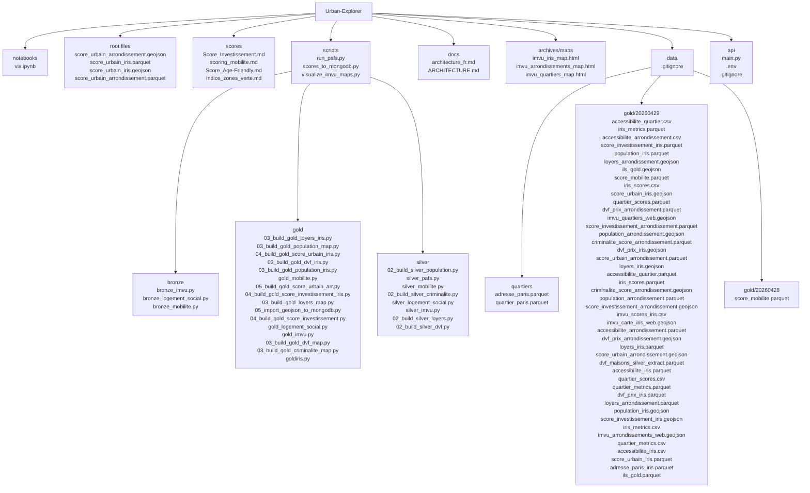

# Project tree — Urban-Explorer

This file contains a rendered Mermaid diagram and a plain-text directory tree of the repository as of this run.

## Mermaid diagram



---

## Plain text tree

```
Urban-Explorer/
├─ notebooks/
│  └─ vix.ipynb
├─ score_urbain_arrondissement.geojson
├─ score_urbain_iris.parquet
├─ score_urbain_iris.geojson
├─ score_urbain_arrondissement.parquet
├─ scores/
│  ├─ Score_Investissement.md
│  ├─ scoring_mobilite.md
│  ├─ Score_Age-Friendly.md
│  └─ Indice_zones_verte.md
├─ scripts/
│  ├─ run_pafs.py
│  ├─ scores_to_mongodb.py
│  ├─ visualize_imvu_maps.py
│  ├─ bronze/
│  │  ├─ bronze_imvu.py
│  │  ├─ bronze_logement_social.py
│  │  └─ bronze_mobilite.py
│  ├─ gold/
│  │  ├─ 03_build_gold_loyers_iris.py
│  │  ├─ 03_build_gold_population_map.py
│  │  ├─ 04_build_gold_score_urbain_iris.py
│  │  ├─ 03_build_gold_dvf_iris.py
│  │  ├─ 03_build_gold_population_iris.py
│  │  ├─ gold_mobilite.py
│  │  ├─ 05_build_gold_score_urbain_arr.py
│  │  ├─ 04_build_gold_score_investissement_iris.py
│  │  ├─ 03_build_gold_loyers_map.py
│  │  ├─ 05_import_geojson_to_mongodb.py
│  │  ├─ 04_build_gold_score_investissement.py
│  │  ├─ gold_logement_social.py
│  │  ├─ gold_imvu.py
│  │  ├─ 03_build_gold_dvf_map.py
│  │  ├─ 03_build_gold_criminalite_map.py
│  │  └─ goldiris.py
│  └─ silver/
│     ├─ 02_build_silver_population.py
│     ├─ silver_pafs.py
│     ├─ silver_mobilite.py
│     ├─ 02_build_silver_criminalite.py
│     ├─ silver_logement_social.py
│     ├─ silver_imvu.py
│     ├─ 02_build_silver_loyers.py
│     └─ 02_build_silver_dvf.py
├─ docs/
│  ├─ architecture_fr.md
│  └─ ARCHITECTURE.md
├─ archives/
│  └─ maps/
│     ├─ imvu_iris_map.html
│     ├─ imvu_arrondissements_map.html
│     └─ imvu_quartiers_map.html
├─ data/
│  ├─ /raw
│  ├─ /silver
│  ├─ quartiers/
│  │  ├─ adresse_paris.parquet
│  │  └─ quartier_paris.parquet
│  └─ gold/
│     ├─ 20260429/
│     │  ├─ accessibilite_quartier.csv
│     │  ├─ iris_metrics.parquet
│     │  ├─ accessibilite_arrondissement.csv
│     │  ├─ score_investissement_iris.parquet
│     │  ├─ population_iris.parquet
│     │  ├─ loyers_arrondissement.geojson
│     │  ├─ ils_gold.geojson
│     │  ├─ score_mobilite.parquet
│     │  ├─ iris_scores.csv
│     │  ├─ score_urbain_iris.geojson
│     │  ├─ quartier_scores.parquet
│     │  ├─ dvf_prix_arrondissement.parquet
│     │  ├─ imvu_quartiers_web.geojson
│     │  ├─ score_investissement_arrondissement.parquet
│     │  ├─ population_arrondissement.geojson
│     │  ├─ criminalite_score_arrondissement.parquet
│     │  ├─ dvf_prix_iris.geojson
│     │  ├─ score_urbain_arrondissement.parquet
│     │  ├─ loyers_iris.geojson
│     │  ├─ accessibilite_quartier.parquet
│     │  ├─ iris_scores.parquet
│     │  ├─ criminalite_score_arrondissement.geojson
│     │  ├─ population_arrondissement.parquet
│     │  ├─ score_investissement_arrondissement.geojson
│     │  ├─ imvu_scores_iris.csv
│     │  ├─ imvu_carte_iris_web.geojson
│     │  ├─ accessibilite_arrondissement.parquet
│     │  ├─ dvf_prix_arrondissement.geojson
│     │  ├─ loyers_iris.parquet
│     │  ├─ score_urbain_arrondissement.geojson
│     │  ├─ dvf_maisons_silver_extract.parquet
│     │  ├─ accessibilite_iris.parquet
│     │  ├─ quartier_scores.csv
     │  ├─ quartier_metrics.parquet
     │  ├─ dvf_prix_iris.parquet
     │  ├─ loyers_arrondissement.parquet
     │  ├─ population_iris.geojson
     │  ├─ score_investissement_iris.geojson
     │  ├─ iris_metrics.csv
     │  ├─ imvu_arrondissements_web.geojson
     │  ├─ quartier_metrics.csv
     │  ├─ accessibilite_iris.csv
     │  ├─ score_urbain_iris.parquet
     │  ├─ adresse_paris_iris.parquet
     │  └─ ils_gold.parquet
     └─ 20260428/
        └─ score_mobilite.parquet
├─ api/
│  ├─ main.py
│  ├─ .env
│  └─ .gitignore

```

---

Diagram saved here: [docs/PROJECT_TREE.md](docs/PROJECT_TREE.md)
