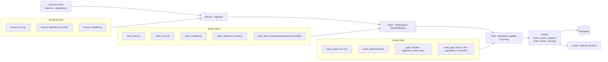

# **Architecture Technique — ETL & Scoring Urban-Explorer**

## **Vue d'ensemble**
- **Objectif** : Documenter le flux ETL Bronze → Silver → Gold, la méthodologie de scoring et les sorties du dépôt Urban-Explorer.
- **Périmètre** : Pipelines locaux/dev actuellement implémentés en scripts Python ; les sorties sont écrites dans le dossier `data/gold` pour les analyses et visualisations en aval.
- **Emplacements clés** : Voir l'annexe ou [docs/PROJECT_TREE.md](docs/PROJECT_TREE.md) pour la liste complète des scripts par couche (Bronze / Silver / Gold) et la documentation des scores.

## **Couches ETL**
- **Bronze** : Ingestion brute et archivage.
  - **Entrée** : fichiers CSV/GeoJSON fournisseurs (exemples dans `data/raw`, et Indice_imvu dans `data/bronze`).
  - **Traitement** : collecte et validation minimale ; conserver les fichiers bruts originaux immuables.
  - **Sortie** : fichiers bruts stockés pour la traçabilité ; source de vérité unique pour les ré-exécutions.

- **Silver** : Nettoyage, normalisation et inférence de types.
  - **Script** : [scripts/silver](scripts/silver).
  - **Transformations** :
    - **Standardisation** : colonnes uniformisées en snake_case et mapping de noms communs.
    - **Normalisation** : standardisation des valeurs manquantes, normalisation textuelle.
    - **Coercition de types** : inférence et nettoyage numérique/date/booléen.
    - **Extraction géo** : extraction lat/lon et préparation des géométries.
    - **Filtrage** : filtrage Paris uniquement (configurable via KEEP_PARIS_ONLY).
    - **Déduplication** : suppression des doublons exacts et réordonnancement des colonnes.
  - **Sortie** : CSV + Parquet nettoyés par exécution sous `data/silver/**.py/`.

- **Gold** : Agrégation spatiale, métriques, normalisation et scoring.
  - **Organisation des scripts** : les scripts Gold suivent une numérotation qui reflète l'ordre d'exécution et le rôle de chaque étape :
    - **`03_*`** — construction des métriques thématiques par maille géographique (IRIS) :
      - [scripts/gold/03_build_gold_loyers_iris.py](scripts/gold/03_build_gold_loyers_iris.py) — loyers médians par IRIS
      - [scripts/gold/03_build_gold_loyers_map.py](scripts/gold/03_build_gold_loyers_map.py) — préparation cartographique des loyers
      - [scripts/gold/03_build_gold_dvf_iris.py](scripts/gold/03_build_gold_dvf_iris.py) — mutations immobilières (DVF) par IRIS
      - [scripts/gold/03_build_gold_dvf_map.py](scripts/gold/03_build_gold_dvf_map.py) — préparation cartographique DVF
      - [scripts/gold/03_build_gold_population_iris.py](scripts/gold/03_build_gold_population_iris.py) — population par IRIS
      - [scripts/gold/03_build_gold_population_map.py](scripts/gold/03_build_gold_population_map.py) — préparation cartographique population
      - [scripts/gold/03_build_gold_criminalite_map.py](scripts/gold/03_build_gold_criminalite_map.py) — criminalité par maille
    - **`04_*`** — calcul des scores composites à partir des métriques `03_*` :
      - [scripts/gold/04_build_gold_score_urbain_iris.py](scripts/gold/04_build_gold_score_urbain_iris.py) — score urbain global par IRIS
      - [scripts/gold/04_build_gold_score_investissement_iris.py](scripts/gold/04_build_gold_score_investissement_iris.py) — score investissement par IRIS
      - [scripts/gold/04_build_gold_score_investissement.py](scripts/gold/04_build_gold_score_investissement.py) — score investissement agrégé
    - **`05_*`** — fusion de tous les outputs Gold en un seul GeoJSON consolidé et export :
      - [scripts/gold/05_build_gold_score_urbain_arr.py](scripts/gold/05_build_gold_score_urbain_arr.py) — merge final au niveau arrondissement → `score_urbain_arrondissement.geojson`
      - [scripts/gold/05_import_geojson_to_mongodb.py](scripts/gold/05_import_geojson_to_mongodb.py) — import du GeoJSON consolidé dans MongoDB
    - **Scripts thématiques sans numérotation** (pipelines indépendants) :
      - [scripts/gold/gold_mobilite.py](scripts/gold/gold_mobilite.py) — métriques et scores de mobilité
      - [scripts/gold/gold_logement_social.py](scripts/gold/gold_logement_social.py) — métriques logement social
      - [scripts/gold/gold_imvu.py](scripts/gold/gold_imvu.py) — indice de mutation du parc immobilier
      - [scripts/gold/goldiris.py](scripts/gold/goldiris.py) — agrégation générale au niveau IRIS
  - **Traitement** :
    - Chargement des tables Silver nettoyées (points, événements, BDCOM, etc.).
    - Chargement des fonds de carte géométriques (GeoJSONs IRIS / quartiers / arrondissements).
    - Conversion des points en GeoDataFrames et jointure spatiale aux polygones.
    - Agrégation des comptages et calcul des densités (par km² ou pour 1 000 habitants).
    - Normalisation des métriques (min–max) et calcul des scores pondérés par profil.
    - Fusion des outputs thématiques en un GeoJSON unique (étape `05_*`).
    - Persistance des sorties en Parquet / GeoJSON et export vers MongoDB.

## **Modèle de Données & Sorties**
- **Sorties Gold principales** : deux fichiers consolidés produits par les scripts `05_*`, disponibles en double format (GeoJSON pour la cartographie, Parquet pour l'analyse) :

  - **Score urbain au niveau arrondissement** :
    - `score_urbain_arrondissement.geojson` / `score_urbain_arrondissement.parquet`
    - Champs clés : `n_sq_ar`, `c_ar`, `c_arinsee`, `l_ar`, `l_aroff`, `annee`, `surface`, `population`, `score_urbain_global`, `score_investissement`, `score_rendement`, `score_criminalite`, `score_securite`, `score_liquidite`, `score_environnement`, `score_vegetation`, `score_parcs`, `score_rues_vegetalisees`, `score_initiatives_vertes`, `score_mobilite`, `score_velib`, `score_stationnement`, `score_transport_commun`, `score_trafic_inverse`, `score_services_quartier`, `score_sante`, `score_education`, `score_sport`, `score_vibrance`, `score_bruit_inverse`, `prix_m2_median`, `loyer_m2_median`, `rendement_brut_pct`, `rendement_net_pct`, `nb_mutations`, `nb_arbres_alignement`, `nb_initiatives`, `nb_arrets_transport`, `nb_stations_velib`, `capacite_velib`, `stationnement_total`

  - **Score urbain au niveau IRIS** :
    - `score_urbain_iris.geojson` / `score_urbain_iris.parquet`
    - Champs supplémentaires par rapport à l'arrondissement : `code_iris`, `nom_iris`, `nom_quartier`, `code_quartier`, `code_quartier_insee`, `nom_commune`, `prix_m2_moyen`, `charges_estimees_pct_loyer`, `liquidite_brute`, `population_hommes`, `population_femmes`, `population_0_14`, `population_15_29`, `population_30_44`, `population_45_59`, `population_60_74`, `population_75_plus`, `ratio_parcs_pct`, `ratio_canopee_pct`, `zone_olap`, `lib_zone`

  - Les deux fichiers partagent la même structure de scores et sont importés dans MongoDB via [`scripts/gold/05_import_geojson_to_mongodb.py`](scripts/gold/05_import_geojson_to_mongodb.py).

## **Diagramme Mermaid du pipeline**

## **Annexe — Liens vers les artefacts clés**

### Scripts Bronze — Ingestion
- **Mutations immobilières (IMVU)** : [scripts/bronze/bronze_imvu.py](scripts/bronze/bronze_imvu.py)
- **Logement social** : [scripts/bronze/bronze_logement_social.py](scripts/bronze/bronze_logement_social.py)
- **Mobilité** : [scripts/bronze/bronze_mobilite.py](scripts/bronze/bronze_mobilite.py)

### Scripts Silver — Nettoyage
- **PAFS** : [scripts/silver/silver_pafs.py](scripts/silver/silver_pafs.py)
- **IMVU** : [scripts/silver/silver_imvu.py](scripts/silver/silver_imvu.py)
- **Loyers** : [scripts/silver/02_build_silver_loyers.py](scripts/silver/02_build_silver_loyers.py)
- **DVF (Demandes de Valeurs Foncières)** : [scripts/silver/02_build_silver_dvf.py](scripts/silver/02_build_silver_dvf.py)
- **Population** : [scripts/silver/02_build_silver_population.py](scripts/silver/02_build_silver_population.py)
- **Criminalité** : [scripts/silver/02_build_silver_criminalite.py](scripts/silver/02_build_silver_criminalite.py)
- **Mobilité** : [scripts/silver/silver_mobilite.py](scripts/silver/silver_mobilite.py)
- **Logement social** : [scripts/silver/silver_logement_social.py](scripts/silver/silver_logement_social.py)

### Scripts Gold — Métriques & Scores
- **Score urbain IRIS** : [scripts/gold/04_build_gold_score_urbain_iris.py](scripts/gold/04_build_gold_score_urbain_iris.py)
- **Score urbain arrondissement** : [scripts/gold/05_build_gold_score_urbain_arr.py](scripts/gold/05_build_gold_score_urbain_arr.py)
- **Score investissement IRIS** : [scripts/gold/04_build_gold_score_investissement_iris.py](scripts/gold/04_build_gold_score_investissement_iris.py)
- **Score investissement** : [scripts/gold/04_build_gold_score_investissement.py](scripts/gold/04_build_gold_score_investissement.py)
- **Loyers IRIS** : [scripts/gold/03_build_gold_loyers_iris.py](scripts/gold/03_build_gold_loyers_iris.py)
- **DVF IRIS** : [scripts/gold/03_build_gold_dvf_iris.py](scripts/gold/03_build_gold_dvf_iris.py)
- **Population IRIS** : [scripts/gold/03_build_gold_population_iris.py](scripts/gold/03_build_gold_population_iris.py)
- **Criminalité** : [scripts/gold/03_build_gold_criminalite_map.py](scripts/gold/03_build_gold_criminalite_map.py)
- **Mobilité** : [scripts/gold/gold_mobilite.py](scripts/gold/gold_mobilite.py)
- **Logement social** : [scripts/gold/gold_logement_social.py](scripts/gold/gold_logement_social.py)
- **IMVU** : [scripts/gold/gold_imvu.py](scripts/gold/gold_imvu.py)
- **Export MongoDB** : [scripts/gold/05_import_geojson_to_mongodb.py](scripts/gold/05_import_geojson_to_mongodb.py)

### Runners & utilitaires
- **Runner PAFS** : [scripts/run_pafs.py](scripts/run_pafs.py)
- **Export scores MongoDB** : [scripts/scores_to_mongodb.py](scripts/scores_to_mongodb.py)
- **Visualisation IMVU** : [scripts/visualize_imvu_maps.py](scripts/visualize_imvu_maps.py)

### Documentation des scores
- **Score Investissement** : [scores/Score_Investissement.md](scores/Score_Investissement.md)
- **Score Mobilité** : [scores/scoring_mobilite.md](scores/scoring_mobilite.md)
- **Score Age-Friendly** : [scores/Score_Age-Friendly.md](scores/Score_Age-Friendly.md)
- **Indice Zones Vertes** : [scores/Indice_zones_verte.md](scores/Indice_zones_verte.md)

### Sorties principales
- **Score urbain arrondissement** : [score_urbain_arrondissement.geojson](score_urbain_arrondissement.geojson), [score_urbain_arrondissement.parquet](score_urbain_arrondissement.parquet)
- **Score urbain IRIS** : [score_urbain_iris.geojson](score_urbain_iris.geojson), [score_urbain_iris.parquet](score_urbain_iris.parquet)